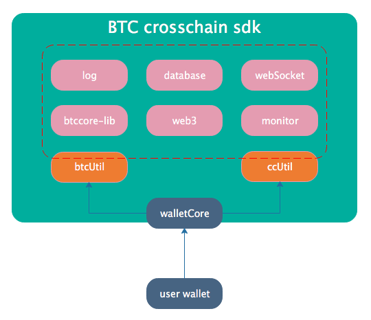
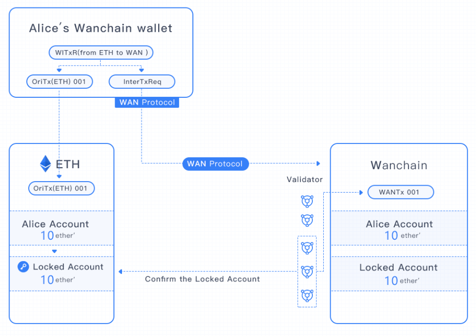
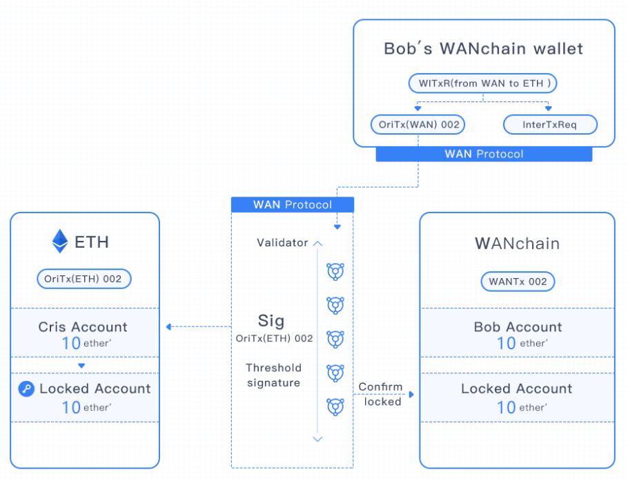
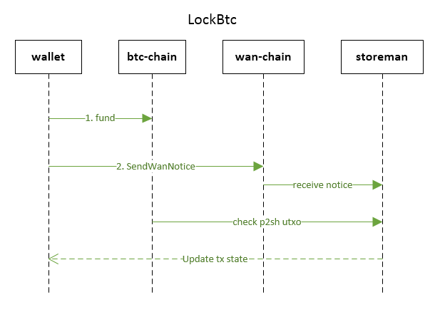
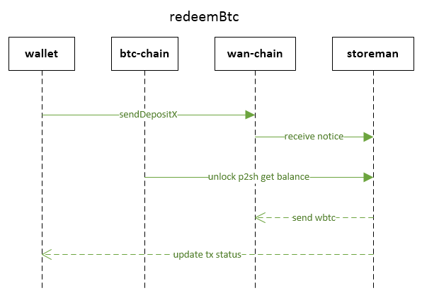
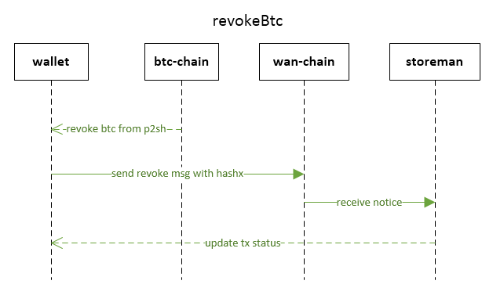
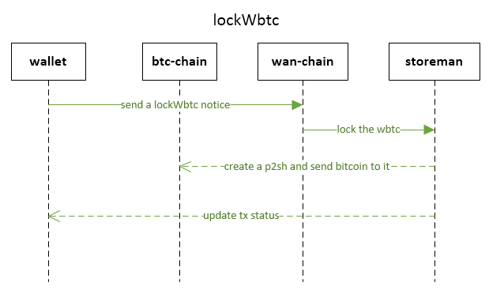
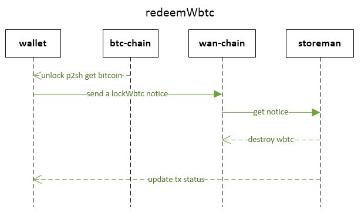
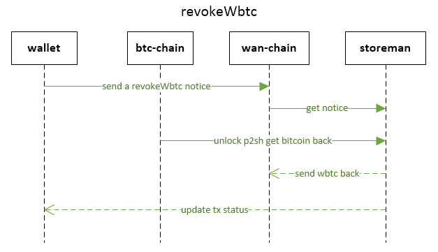

# Wanchain CrossChain for BTC SDK User Manual

--------

# Contents
<!-- TOC -->

- [Wanchain CrossChain for BTC SDK User Manual](#wanchain-crosschain-for-btc-sdk-user-manual)
- [Contents](#contents)
- [1. Introduction](#1-introduction)
  - [1.1 Function and use](#11-function-and-use)
  - [1.2 Architecture](#12-architecture)
  - [1.3 Crosschain transaction](#13-crosschain-transaction)
  - [1.4 Base step for crosschain transaction](#14-base-step-for-crosschain-transaction)
  - [1.5 Function for normal transaction](#15-function-for-normal-transaction)
- [2. Usage](#2-usage)
  - [2.1 Install and require](#21-install-and-require)
  - [2.2 Initialize](#22-initialize)
  - [2.3 Create btc address](#23-create-btc-address)
  - [2.4 Remove btc address](#24-remove-btc-address)
  - [2.5 Create wan account](#25-create-wan-account)
  - [2.6 Get BTC balance](#26-get-btc-balance)
  - [2.7 Get WAN balance](#27-get-wan-balance)
  - [2.8 Get WBTC balance](#28-get-wbtc-balance)
  - [2.9 Get storeman groups information](#29-get-storeman-groups-information)
  - [2.10 Get transaction information](#210-get-transaction-information)
  - [2.11 Normal BTC transaction](#211-normal-btc-transaction)
  - [2.12 BTC -> WBTC crosschain transaction](#212-btc---wbtc-crosschain-transaction)
    - [2.12.1 LockBtc](#2121-lockbtc)
    - [2.12.2 redeemBtc](#2122-redeembtc)
    - [2.12.3 revokeBtc](#2123-revokebtc)
  - [2.13 WBTC -> BTC crosschain](#213-wbtc---btc-crosschain)
    - [2.13.1 lockWbtc](#2131-lockwbtc)
    - [2.13.2 redeemWbtc](#2132-redeemwbtc)
    - [2.13.3 revokeWbtc](#2133-revokewbtc)

<!-- /TOC -->

# 1. Introduction

This is a user manual which tell developers how to use the Wanchain CrossChain for BTC sdk.

## 1.1 Function and use

Wanchain CrossChain for BTC sdk has many useful tools and function for developers to develop a custom crosschain wallet.

Developers can use this sdk to perform crosschain transactions between BTC blockchain and WAN blockchain.

## 1.2 Architecture

The sdk's mainly architecture is like the diagram blow.



Developers use the walletCore for the sdk's init. And sdk exports the mainly interfaces in btcUtl and ccUtil.

## 1.3 Crosschain transaction

People who use crosschain transaction have two direction.

- Send coins to crosschain account (storeman) and redeem the tokens of the coins.
- Sent tokens to crosschain account (storeman) and redeem the coins.

Below two diagrams is copied from the Wanchain-Whitepaper, which is using to describe wan-eth's two direction of crosschain.

We can replace the eth and ether' to btc and wbtc to use this diagram to understand btc's crosschain transaction.

- The first diagram is ETH to WAN crosschain.



- The second diagram is WAN to ETH crosschain.



## 1.4 Base step for crosschain transaction

- **BTC -> WBTC**
  - **lockBtc**: Prepare in btc chain and wan chain.
  - **redeemBtc**: Comfirm the transaction and get the tokens.
  - **revokeBtc**: Cancel the transaction and get coins back.
- **WBTC -> BTC**
  - **lockWbtc**: Prepare in btc chain and wan chain.
  - **redeemWbtc**: Comfirm the transaction and get the coins.
  - **revokeWbtc**: Cancel the transaction and get tokens back.

## 1.5 Function for normal transaction

- **sendBtcToAddress**: Normal btc transaction.
- **createBtcAddress**: Create a btc address with password and save the address into local wallet database file. The password is use to encrypt private key which is genrate by bitcoin-lib.
- **removeBtcAddress**: Remove a btc address from local database file with password. The password is use to check your permission.

---

# 2. Usage

The detailed code example can be found in cli wallet code in Github.

[https://github.com/wanchain/wanchain-crosschain-walletcli/blob/wanchain30_release/cli.js](https://github.com/wanchain/wanchain-crosschain-walletcli/blob/wanchain30_release/cli.js)


## 2.1 Install and require

Developers can use commands below to install and require the sdk package.

Install npm sdk package with yarn command.

```
$ yarn add wanchain-crosschainbtc
$ yarn
```

Install npm sdk package with npm command.

First to add script in `package.json`:
```
"wanchain-crosschainbtc": "^1.0.2",
```

Then run the command:
```
npm install
```

Require the package in your code like this:
```
let WanchainCore = require('wanchain-crosschainbtc');
```

## 2.2 Initialize

Developers need to initialize th SDK like this:
```
    wanchainCore = new WanchainCore(config);
    let ccUtil = wanchainCore.be;
    let btcUtil = wanchainCore.btcUtil;
    await wanchainCore.init(config);
```
The `ccUtil` and `btcUtil` is the mainly interface of sdk.

The `config` is a config.js file like below. It contains the config information for sdk such as network/logPath/dbPath and so on.

```
const config = {};

if(global.isTestnet){
    config.network = 'testnet';
    config.networkPath = 'testnet';
    console.log("This is testnet");
}else {
    config.network = 'mainnet';
    config.networkPath = '';
    console.log("This is mainnet");
}
const path=require('path');
const bitcoin = require('bitcoinjs-lib');
const Logger = require('./logger/logger.js');
config.ccLog = path.join('logs', 'crossChainLog.log');
config.ccErr = path.join('logs', 'crossChainErr.log');
config.logger = new Logger('CrossChain',config.ccLog, config.ccErr,config.loglevel);
config.getLogger = function(name){
    return new Logger(name,config.ccLog, config.ccErr,config.loglevel);
}

config.gasLimit = 1000000;
config.gasPrice = 200000000000;


if (process.platform === 'darwin') {
    config.rpcIpcPath = path.join(process.env.HOME, '/Library/Wanchain',config.networkPath,'gwan.ipc');
    config.keyStorePath = path.join(process.env.HOME, '/Library/Wanchain/',config.networkPath,'keystore');
    config.ethkeyStorePath = path.join(process.env.HOME, '/Library/ethereum/',config.networkPath,'keystore/');
    config.databasePath = path.join(process.env.HOME,'Library/LocalDb');
} else if (process.platform === 'freebsd' || process.platform === 'linux' || process.platform === 'sunos') {
    config.rpcIpcPath = path.join(process.env.HOME, '.wanchain',config.networkPath,'gwan.ipc');
    config.keyStorePath = path.join(process.env.HOME, '.wanchain',config.networkPath,'keystore');
    config.ethkeyStorePath = path.join(process.env.HOME, '.ethereum',config.networkPath,'keystore');
    config.databasePath = path.join(process.env.HOME,'LocalDb');
} else if (process.platform === 'win32') {
    config.rpcIpcPath = '\\\\.\\pipe\\gwan.ipc';
    config.keyStorePath = path.join(process.env.APPDATA, 'wanchain', config.networkPath, 'keystore');
    config.ethkeyStorePath = path.join(process.env.APPDATA, 'ethereum', config.networkPath, 'keystore');
    config.databasePath = path.join(process.env.APPDATA,'LocalDb');
}

config.port = 8545;
config.useLocalNode = false;
config.loglevel = 'info';
//config.loglevel = 'debug';

config.MAX_CONFIRM_BLKS = 100000000;
config.MIN_CONFIRM_BLKS = 0;
config.listOption = true;
if(config.network == 'testnet'){
    config.bitcoinNetwork = bitcoin.networks.testnet;
    config.feeRate = 300;
    config.feeHard = 100000;
    config.confirmBlocks = 3;
    config.btcConfirmBlocks = 1;
    config.wanchainHtlcAddr = "0xb248ed04e1f1bbb661b56f210e4b0399b2899d16";
    config.WBTCToken = "0x89a3e1494bc3db81dadc893ded7476d33d47dcbd";
    config.socketUrl = 'wss://apitest.wanchain.info';
    config.btcWallet = path.join(config.databasePath, 'btcWallet.db');
    config.crossDbname = path.join(config.databasePath, 'crossTransDbBtc');
} else {
    config.bitcoinNetwork = bitcoin.networks.bitcoin;
    config.feeRate = 30;
    config.feeHard = 10000;
    config.confirmBlocks = 12;
    config.btcConfirmBlocks = 3;
    config.wanchainHtlcAddr = "0x802894ef36050c9b8e94f8d0979c75512491b7d5";
    config.WBTCToken = "0xfa4b6988e8cb90bb25e51ea80257ffcdd8ebdd24";
    config.socketUrl = 'wss://api.wanchain.info';
    config.btcWallet = path.join(config.databasePath, 'main_btcWallet.db');
    config.crossDbname = path.join(config.databasePath, 'main_crossTransDbBtc');
}

config.wanKeyStorePath = config.keyStorePath;
config.ethKeyStorePath = config.ethkeyStorePath;


config.consoleColor = {
    'COLOR_FgRed': '\x1b[31m',
    'COLOR_FgYellow': '\x1b[33m',
    'COLOR_FgGreen': "\x1b[32m"
};


module.exports = config;

```
You can get the last config file in github: [https://github.com/wanchain/wanchain-crosschain-walletcli/blob/wanchain30_release/config.js](https://github.com/wanchain/wanchain-crosschain-walletcli/blob/wanchain30_release/config.js) 

In the config file, the `global.isTestnet` is a selection of 'testnet' or 'mainnet'. Developers must set it's value before use. 

Such as:
```
 global.isTestnet = true; //true for testnet and false for mainnet.
```

The data in `config` is important and other code can be monify by user's custom.

Before initialize the sdk, add code to require `config.js` file.
```
let config = require('./config.js');
```
There is some `default` config information in sdk's config file.

User's config value will `cover` the default values.

After initial, the sdk's `monitor` is running in `background` to update the transaction's `status` every 6 seconds.

## 2.3 Create btc address

Before users use crosschain transaction they must have btc address in sdk's local database.

We can create a btc address use code like this:
```
//Create btc address use password.
let newAddress = await btcUtil.createAddress(btcPassword);

//Import the address created into the btc-node.
await ccUtil.btcImportAddress(ccUtil.btcSender, newAddress.address);
```

It's nececery to check the password's length that is `large than 8 chars` before create.

And must perform a import to use this address.

You must use new btc address for crosschain which is create by sdk.

You must use the same password for each password created.

You can list your btc addresses use this code:
```
let addressList = await btcUtil.getAddressList();
```

## 2.4 Remove btc address

Remove a btc address from local database file with password. The password is use to check your permission.

```
await btcUtil.removeAddress(addr, password);
```

## 2.5 Create wan account

Add keythereum and wanchain-util package in `package.json`

```
const keythereum = require("keythereum");
keythereum.constants.quiet = true;
const wanUtil = require('wanchain-util');

let keyPassword = 'YOUR_WAN_PASSWORD';

//create the path if it's not exist.
//mkdirsSync(config.wanKeyStorePath);

//Set the encrypt param
let params = { keyBytes: 32, ivBytes: 16 };
let options = {
    kdf: "scrypt",
    cipher: "aes-128-ctr",
    kdfparams: {
        n: 262144,
        dklen: 32,
        prf: "hmac-sha256"
    }
};

let dk = keythereum.create(params);
let keyObject = keythereum.dump(keyPassword, dk.privateKey, dk.salt, dk.iv, options);

let dk2 = keythereum.create(params);
let keyObject2 = keythereum.dump(keyPassword, dk2.privateKey, dk2.salt, dk2.iv, options);
keyObject.crypto2 = keyObject2.crypto;

keyObject.waddress = wanUtil.generateWaddrFromPriv(dk.privateKey, dk2.privateKey).slice(2);
keythereum.exportToFile(keyObject, config.wanKeyStorePath);

console.log("Your WAN address is: 0x"+keyObject.address);
```


****
**ATTENTION**：You must get some balance in your wan account and btc address before you try the crosschain transaction. That's why we learn create account first. 
****

## 2.6 Get BTC balance

You can get the balance of your btc address like this:

```
let addressList = await btcUtil.getAddressList();
let array = [];

if (addressList.length === 0) {
  console.log('no btc address)
  return;
}

try{
    for (let i=0;i<addressList.length; i++) {
        array.push(addressList[i].address)
    }

    let utxos = await ccUtil.getBtcUtxo(ccUtil.btcSender, config.MIN_CONFIRM_BLKS, config.MAX_CONFIRM_BLKS, array);
    let result = await ccUtil.getUTXOSBalance(utxos);

    let print = 'btcBalance: ' + web3.toBigNumber(result).div(100000000).toString();
    console.log(print);
} catch (e) {
    console.log(e.message);
    return;
}
```

## 2.7 Get WAN balance

You can get the balance of your wan account like below, and add web3 into `package.json`:

```
let Web3 = require("web3");
let web3 = new Web3(new Web3.providers.HttpProvider('http://localhost:8545'));
let wanAddressList = [];
let print;
try {
  wanAddressList = await ccUtil.getWanAccountsInfo(ccUtil.wanSender);
  wanAddressList.forEach(function(wanAddress, index){
    print = (index +1) + ' - ' + wanAddress.address + ',' + web3.fromWei(wanAddress.balance));
    console.log(print);
  });
}catch(e) {
  console.log(e.message);
  return;
}
```

## 2.8 Get WBTC balance

You can get the balance of your wbtc like below, and add web3 into `package.json`:

```
let Web3 = require("web3");
let web3 = new Web3(new Web3.providers.HttpProvider('http://localhost:8545'));
// wan address list
let wanAddressList = [];
let print;
let tokenBalance;
try {
  wanAddressList = await ccUtil.getWanAccountsInfo(ccUtil.wanSender);
  wanAddressList.forEach(function(wanAddress, index){
    tokenBalance = web3.toBigNumber(wanAddress.tokenBalance).div(100000000);
    print = (index +1) + ': ' + wanAddress.address+ ', ' + tokenBalance);
    console.log(print);
  });
}catch(e) {
  console.log(e.message);
  return;
}
```

## 2.9 Get storeman groups information

You can get the storemangroups info like this:
```
let smgs = await ccUtil.getBtcSmgList(ccUtil.btcSender);
```
## 2.10 Get transaction information

You can get the transactions' info like this:
```
let records = ccUtil.getBtcWanTxHistory({});
```

And you can fill a filter to get custom records such as:
```
let records = ccUtil.getBtcWanTxHistory({status: 'waitingX', chain: 'BTC'});
```

## 2.11 Normal BTC transaction

You can perform a normal btc to btc transaction like this:
```
let btcPasswd = 'Your btc password';
let amount = 0.02; // The amount you want to send.
let to = 'mtCotFuC1JP448Y3uhEbyPeP7UduYUn6Vb'; // The address which you send to.

let btcBalance = 0;
let addressList;
let utxos;
// Filter address by btc balance to speed up decrypt.
try{
  addressList = await btcUtil.getAddressList();
  addressList = await ccUtil.filterBtcAddressByAmount(addressList, amount);
  utxos = await ccUtil.getBtcUtxo(ccUtil.btcSender, config.MIN_CONFIRM_BLKS, config.MAX_CONFIRM_BLKS, addressList);
  let result = await ccUtil.getUTXOSBalance(utxos);
  btcBalance = web3.toBigNumber(result).div(100000000);
} catch (e) {
  return;
}

let keyPairArray = [];
try {
  //Decrypt the private key.
  for (let i = 0; i < addressList.length; i++) {
    let kp = await btcUtil.getECPairsbyAddr(btcPasswd, addressList[i]);
    keyPairArray.push(kp);
  }
  if (keyPairArray.length === 0) {
    return;
  }
  let target = {
    address: to,
    value: Number(web3.toBigNumber(amount).mul(100000000))
  };
  const {rawTx, fee} = await ccUtil.btcBuildTransaction(utxos, keyPairArray, target, config.feeRate);
  if (!rawTx) {
    return;
  }
  let result = await ccUtil.sendRawTransaction(ccUtil.btcSender, rawTx);
  console.log('hash: ', result);

  let txInfo = {
    from: 'local btc account',
    to: target.address,
    value: target.value,
    txHash: result,
    status: 'SUCCESS',
    crossType: 'BTC2WAN'
  };
  //Save the txInfo into local tx database.
  ccUtil.saveNormalBtcTransactionInfo(txInfo);
} catch (e) {
  return;
}
```
## 2.12 BTC -> WBTC crosschain transaction

These are three steps to perform a crosschain transaction.
  - **lockBtc**: Prepare in btc chain and wan chain.
  - **redeemBtc**: Comfirm the transaction and get the tokens.
  - **revokeBtc**: Cancel the transaction and get coins back.

### 2.12.1 LockBtc

When users perform a lockBtc operation. They need two steps like below diagram.



Developers can write code like below.

Add `bitcoinjs-lib` in `package.json`.

Prepare the input params and fill them first.

```
const bitcoin  = require('bitcoinjs-lib');

//Prepare and fill these input params
let keyPairArray = [];  //Decrypted private key pairs (2.11 Normal BTC transaction)
let storeman = '';      //Storeman wan address
let smgBtcAddr = '';    //Storeman btc address
let amount = 0.002;     //Amount to crosschain
let wanAddress = '';    //Local wan address to crosschain
let wanPasswd = 'Your wan password'; //Your wan account password

let value = Number(web3.toBigNumber(amount).mul(100000000));

//Step 1 fund in btc chain
let record = await ccUtil.fund(keyPairArray, smgBtcAddr, value);

// notice wan.
const tx = {};
tx.storeman = storeman;
tx.from = wanAddress;
tx.userH160 = '0x'+bitcoin.crypto.hash160(keyPairArray[0].publicKey).toString('hex');
tx.hashx = '0x'+record.hashx;
tx.txHash = '0x'+record.txhash;
tx.lockedTimestamp = record.redeemLockTimeStamp;
tx.gas = config.gasLimit;
tx.gasPrice = config.gasPrice;
tx.passwd= wanPasswd;
  
let txHash;

//Step 2 send wan notice in wan chain
try {
  txHash = await ccUtil.sendWanNotice(ccUtil.wanSender, tx);
} catch (e) {
  console.log("get sendWanNotice error: ", e.message||e);
}
                                
```

### 2.12.2 redeemBtc

After the transaction's status changed to `waitingX`, you can confirm this transaction with `redeemBtc`.



Code like below:
```
let wanPasswd = 'Your wan password'; //Your wan account password
//The hashx value of the tx which to redeem.
let hashx = '67bd013c1a516712e090c21bfd75773ede3e0006250d3abaae5221f572c6520b';   

let records = await ccUtil.getBtcWanTxHistory({HashX: hashx, status: 'waitingX', chain: 'BTC'});
let record = records[0];    //Find the record 

try {
  let redeemHash = await ccUtil.sendDepositX(ccUtil.wanSender, '0x'+record.crossAddress,
    config.gasLimit, config.gasPrice,'0x'+record.x, wanPasswd);
  console.log("redeemHash: ", redeemHash);
} catch (e) {
  return;
}
```

User can redeem the transaction before timeout reached.

When the redeem time passed, the transaction's status will change and can not redeem, but can perform a revoke after a revoke time.

If you do not have a hashx, you can run `ccUtil.getBtcWanTxHistory` without `HashX: hashx`, and it will show all the tx in waitingX status, you can select one of these to use.

### 2.12.3 revokeBtc

If users have not perform redeemBtc at redeem time span, they can perform a revokeBtc when the transaction's status changed to waitingRevoke.

RevokeBtc means cancel crosschain transaction and get coins back.




Code like below:
```
//Fill the input param first.
let HashX = '';         //tx's HashX
let from = '';          //Your from btc address
let btcPassword = '';   //Your btc password

let alice = await btcUtil.getECPairsbyAddr(btcPassword, from);

if (alice.length === 0) {
  throw new Error('Password of btc is wrong!');
}

let txhash = await ccUtil.revokeWithHashX(HashX, alice);

console.log('revokeBtc finish, txhash:' + txhash);
```

## 2.13 WBTC -> BTC crosschain
These are three steps to perform a crosschain transaction.
- **lockWbtc**: Prepare in btc chain and wan chain.
- **redeemWbtc**: Comfirm the transaction and get the coins.
- **revokeWbtc**: Cancel the transaction and get tokens back.

### 2.13.1 lockWbtc

User use lockWbtc to perform a crosschain prepare.



Code like below:
```
try {
  //Fill the input param first.
  let storeman = {};  //A storeman object from one of storeman array got in `2.9 Get storeman groups information`
  let wanAddress = '';//User's wan address
  let btcAddress = '';//User's btc address in bs58check format
  let wanPassword = '';//User's wan password
  let amount = 0.02;    //The amount to crosschain

  //Check whether the wbtc balance is enought.
  //This method can not use local node, must use remote node.
  let wanAddressList = await ccUtil.getWanAccountsInfo(ccUtil.wanSender);

  let wbtcEnough;
  wanAddressList.forEach(function (wanAddr) {
    if (wanAddress === wanAddr.address) {
      let wbtcBalance = web3.toBigNumber(wanAddr.tokenBalance).div(100000000);
      wbtcEnough = btcScripts.checkBalance(amount, wbtcBalance);
      log.info(`amount:${Number(amount)}, wbtcBalance:${Number(wbtcBalance.toString())}`);
    }
  });

  if (wbtcEnough === false) {
    log.error(JSON.stringify(wanAddressList, null, 4));
    log.error(wanAddress);
    throw new Error('The wbtc balance is not enough.');
  }

  if (wbtcEnough === undefined) {
    throw new Error('The wan address is invalid. input:' + wanAddress + ', list: ' + JSON.stringify(wanAddressList, null, 4));
  }

  //Make the wdTx
  let wdTx = {};
  wdTx.gas = config.gasLimit;
  wdTx.gasPrice = config.gasPrice;
  wdTx.passwd = wanPassword;
  let btcAddr = btcAddress;
  wdTx.cross = '0x' + btcUtil.addressToHash160(btcAddr, 'pubkeyhash', settings.btcNetwork);
  wdTx.from = wanAddress;
  wdTx.amount = Number(web3.toBigNumber(amount).mul(100000000));
  wdTx.storemanGroup = storeman.wanAddress;
  wdTx.value = ccUtil.calculateLocWanFee(wdTx.amount, ccUtil.c2wRatio, storeman.txFeeRatio);
  let x = btcUtil.generatePrivateKey().slice(2);
  wdTx.x = x;

  log.debug('Ready to send wdTx...');

  //Finish the lockWbtc
  let wdHash = await ccUtil.sendWanHash(wanSender, wdTx);
} catch (error) {
}
```

### 2.13.2 redeemWbtc

After the transaction's status changed to `waitingX`, you can confirm this transaction with `redeemWbtc`.



Code like below:
```
try {
  //Fill the input param first.
  let crossAddress = '';  //Get this value in record (Get it as in 2.12.2 redeemBtc)
  let HashX = '';         //Get this value in record (Get it as in 2.12.2 redeemBtc)
  let btcPassword = '';   //User's btc password

  let aliceAddr
  if (crossAddress.startsWith('0x')) {
    aliceAddr = btcUtil.hash160ToAddress(crossAddress, 'pubkeyhash', settings.btcNetwork);
  } else {
    aliceAddr = crossAddress;
  }

  let alice = await btcUtil.getECPairsbyAddr(btcPassword, aliceAddr);

  if (alice.length === 0) {
    throw new Error('Password of btc is wrong!');
  }

  let walletRedeem = await ccUtil.redeemWithHashX(HashX, alice);
  log.debug('redeemWbtc walletRedeem: ', walletRedeem);
} catch (error) {
}
```

User can redeem the transaction before timeout reached.

When the redeem time passed, the transaction's status will change and can not redeem, but can perform a revoke after a revoke time.

### 2.13.3 revokeWbtc

If users have not perform redeemWbtc at redeem time span, they can perform a revokeWbtc when the transaction's status changed to waitingRevoke.

RevokeWbtc means cancel crosschain transaction and get wbtc back.



Code like below:
```
try {
  let from = '';//The wbtc from address. Get this value in record. (Get record as in 2.12.2 redeemBtc)
  let HashX = '';//This value must has a 0x prefix. Get this value in record. (Get record as in 2.12.2 redeemBtc)
  let wanPassword = ''; //User's wan password

  if (!ccUtil.checkWanPassword(from, wanPassword)) {
    throw new Error('wrong password of wan.');
  }

  let revokeWbtcHash = await ccUtil.sendWanCancel(wanSender, from,
    config.gasLimit, config.gasPrice, HashX, wanPassword);
} catch (error) {
}
```
